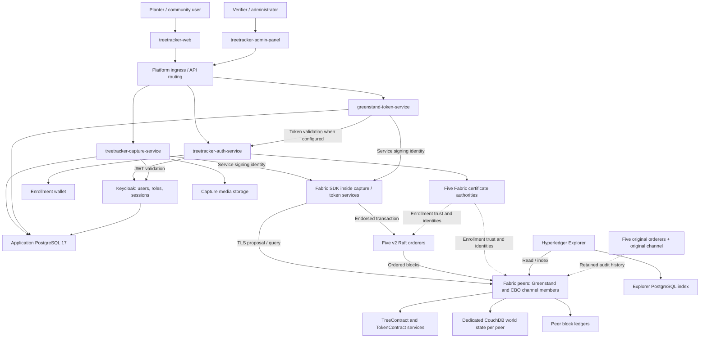
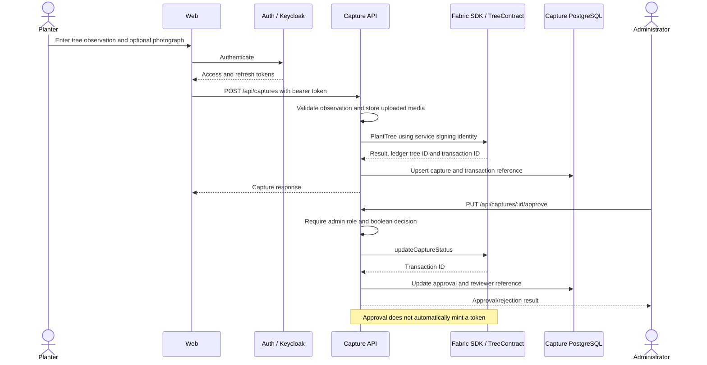
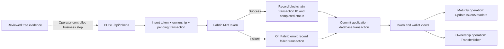

<div align="center">
  <h3>🌳 Blockchain-based Tree Tracking Network 🌳</h3>
  <p>A production-ready Hyperledger Fabric network for transparent tree planting and carbon offset tracking</p>
</div>

[](https://hyperledger-fabric.readthedocs.io/)
[](https://kubernetes.io/)
[](https://opensource.org/licenses/Apache-2.0)
[](#)

---

## 🌍 Overview

The Hyperledger Fabric Treetracker Network is a blockchain-based solution designed to provide transparent, immutable tracking of tree planting initiatives and carbon offset programs. Built for [Greenstand](https://greenstand.org/) and partners, this network ensures accountability in environmental restoration projects through distributed ledger technology.

### Key Features

- **🔒 Immutable Tree Records** - Every tree planting event is permanently recorded on the blockchain
- **🤝 Multi-Organization Network** - Supports Greenstand, CBOs, Investors, and Verifiers
- **🌐 Public Transparency** - All stakeholders can verify tree planting data
- **📊 Real-time Analytics** - Live dashboards for monitoring forest restoration progress
- **🔐 Enterprise Security** - Certificate-based authentication and TLS encryption
- **📈 Scalable Infrastructure** - Kubernetes-based deployment supporting global operations

---

## 🏗️ Network Architecture

### Organizations

| Organization | Role | Peers | Description |
|--------------|------|-------|-------------|
| **Greenstand** | Network Admin | 3 | Primary tree tracking organization |
| **CBO** | Tree Planters | 2 | Community-Based Organizations |
| **Investor** | Funders | 2 | Carbon offset purchasers |
| **Verifier** | Validators | 1 | Independent verification entities |

### Network Components

- **🏦 Ordering Service**: 5-node Raft consensus cluster
- **🔐 Certificate Authorities**: 5 CAs (1 Root + 4 Organization CAs)
- **📊 Monitoring**: Prometheus + Grafana stack
- **🗄️ Storage**: Persistent volumes with automatic backup
- **🌐 API Gateway**: RESTful APIs for external integration

---

## 🚀 Quick Start

### Prerequisites

- **Kubernetes Cluster**: v1.23+ with 5+ nodes
- **Storage**: 500GB+ SSD with dynamic provisioning
- **Resources**: 32+ CPU cores, 64GB+ RAM
- **Network**: LoadBalancer support for external access

### 1. Clone the Repository

```bash
git clone https://github.com/Greenstand/hyperledger-fabric-network.git
cd hyperledger-fabric-network
```

### 2. Deploy the Network

```bash
# Deploy complete network infrastructure
./scripts/deploy-treetracker-network.sh

# Create channels
./scripts/create-channels.sh

# Deploy chaincode
./scripts/deploy-chaincode.sh

# Verify deployment
./scripts/test-network.sh
```

### 3. Access the Network

```bash
# Get network status
kubectl get pods --all-namespaces | grep hlf-

# Access API Gateway
kubectl port-forward svc/api-gateway 8080:80 -n treetracker-apps

# View monitoring dashboard
kubectl port-forward svc/grafana 3000:3000 -n monitoring
```

---

## 📚 Documentation

Comprehensive documentation is available in the `/docs` directory:

### For Users & Operators
- 📖 **[User Manual](docs/TREETRACKER_USER_MANUAL.md)** - Complete user guide for network operations
- 🛠️ **[Deployment Guide](docs/TREETRACKER_DEPLOYMENT_GUIDE.md)** - Step-by-step deployment instructions

### For Developers
- 💻 **[Integration Manual](docs/TREETRACKER_INTEGRATION_MANUAL.md)** - SDK usage and API integration
- 🏗️ **[Architecture Guide](docs/TREETRACKER_ARCHITECTURE_GUIDE.md)** - Network design and component details

### Quick Reference
- [API Documentation](docs/TREETRACKER_INTEGRATION_MANUAL.md#api-reference)
- [Chaincode Functions](docs/TREETRACKER_INTEGRATION_MANUAL.md#chaincode-development)
- [Troubleshooting Guide](docs/TREETRACKER_DEPLOYMENT_GUIDE.md#troubleshooting)
- [Monitoring & Alerts](docs/TREETRACKER_ARCHITECTURE_GUIDE.md#monitoring-and-observability)

---

## 🌐 Network Endpoints

### Production Network
- **API Gateway**: `https://api.treetracker.network`
- **Blockchain Explorer**: `https://explorer.treetracker.network`
- **Monitoring Dashboard**: `https://monitoring.treetracker.network`

### Development Network
- **API Gateway**: `http://localhost:8080`
- **Grafana**: `http://localhost:3000`
- **Prometheus**: `http://localhost:9090`

---

## 🔧 Directory Structure

```
hyperledger-fabric-network/
├── 📁 chaincode/              # Smart contracts
│   └── treetracker/           # Tree tracking chaincode (Go)
├── 📁 config/                 # Network configuration
│   ├── configtx.yaml         # Channel configuration
│   ├── crypto-config.yaml    # Certificate configuration
│   └── network-config.yaml   # Main network settings
├── 📁 docs/                   # Documentation
│   ├── TREETRACKER_USER_MANUAL.md
│   ├── TREETRACKER_INTEGRATION_MANUAL.md
│   ├── TREETRACKER_ARCHITECTURE_GUIDE.md
│   └── TREETRACKER_DEPLOYMENT_GUIDE.md
├── 📁 k8s/                    # Kubernetes manifests
│   ├── ca/                   # Certificate Authority deployments
│   ├── orderer/              # Orderer node deployments
│   ├── peers/                # Peer node deployments
│   └── monitoring/           # Monitoring stack
├── 📁 scripts/               # Deployment and management scripts
│   ├── deploy-treetracker-network.sh
│   ├── create-channels.sh
│   ├── deploy-chaincode.sh
│   └── test-network.sh
└── 📁 api/                   # REST API gateway
    ├── nodejs/               # Node.js SDK integration
    └── gateway/              # API Gateway service
```

---

## 🔐 Security Features

### Certificate Management
- **Root CA**: Self-signed root certificate authority
- **Organization CAs**: Individual CAs for each organization
- **TLS Encryption**: All network communication encrypted
- **Certificate Rotation**: Automated certificate lifecycle management

### Network Security
- **RBAC**: Role-based access control for all operations
- **Network Policies**: Kubernetes network segmentation
- **Mutual TLS**: Peer-to-peer authentication
- **HSM Support**: Hardware security module integration (optional)

### Data Privacy
- **Channel Isolation**: Private data channels between organizations
- **Endorsement Policies**: Multi-signature transaction validation
- **Audit Trails**: Immutable transaction logs
- **Data Encryption**: At-rest and in-transit encryption

---

## 📊 Monitoring & Observability

### Metrics Collection
- **Peer Metrics**: Transaction throughput, ledger size, endorsement latency
- **Orderer Metrics**: Block creation rate, consensus performance
- **Network Metrics**: Channel health, certificate status
- **Application Metrics**: API response times, chaincode execution

### Alerting
- **Network Health**: Peer/orderer downtime alerts
- **Performance**: Transaction latency thresholds
- **Security**: Certificate expiration warnings
- **Capacity**: Storage and resource utilization

### Dashboards
- **Executive Dashboard**: High-level KPIs and network status
- **Operations Dashboard**: Detailed technical metrics
- **Business Dashboard**: Tree planting progress and carbon metrics

---

## 🧪 Testing & Quality Assurance

### Test Coverage
- **Unit Tests**: Chaincode function testing
- **Integration Tests**: End-to-end network testing
- **Performance Tests**: Load testing and benchmarking
- **Security Tests**: Penetration testing and vulnerability scans

### Continuous Integration
- **Automated Testing**: GitHub Actions CI/CD pipeline
- **Code Quality**: SonarQube analysis
- **Security Scanning**: Container and dependency scanning
- **Deployment Testing**: Automated deployment validation

---

## 🚀 Deployment Options

### Cloud Providers
- **AWS**: EKS with managed services
- **Google Cloud**: GKE with Cloud SQL
- **Azure**: AKS with Azure Storage
- **DigitalOcean**: DOKS with block storage

### On-Premises
- **Bare Metal**: Direct Kubernetes installation
- **VMware**: vSphere with Tanzu
- **OpenShift**: Red Hat OpenShift platform

### Development
- **Kind**: Local Kubernetes in Docker
- **Minikube**: Single-node local cluster
- **Docker Compose**: Simplified local development

---

## 🤝 Contributing

We welcome contributions from the community! Please see our [Contributing Guidelines](CONTRIBUTING.md) for details.

### Development Workflow
1. Fork the repository
2. Create a feature branch
3. Make your changes with tests
4. Submit a pull request

### Code Standards
- **Go**: Follow Go best practices for chaincode
- **JavaScript**: ESLint configuration for API code
- **Documentation**: Update docs for any API changes
- **Testing**: Maintain 80%+ test coverage

---

## 📞 Support & Community

### Getting Help
- **Documentation**: Comprehensive guides in `/docs`
- **GitHub Issues**: Bug reports and feature requests
- **Discord**: Real-time community support
- **Email**: technical-support@greenstand.org

### Community Resources
- **Greenstand Website**: [https://greenstand.org](https://greenstand.org)
- **Slack Channel**: [#treetracker-blockchain](https://greenstand.slack.com)
- **Developer Forum**: [https://forum.greenstand.org](https://forum.greenstand.org)

---

## 📈 Roadmap

### Current Release (v1.0)
- ✅ Multi-organization network
- ✅ Tree tracking chaincode
- ✅ Kubernetes deployment
- ✅ Monitoring and alerting

### Next Release (v1.1)
- 🔄 Mobile wallet integration
- 🔄 Carbon credit tokenization
- 🔄 Enhanced analytics dashboard
- 🔄 Multi-chain interoperability

### Future Releases
- 📋 IoT sensor integration
- 📋 Satellite imagery verification
- 📋 Machine learning analytics
- 📋 Cross-border payment rails

---

## 📄 License

This project is licensed under the Apache License 2.0 - see the [LICENSE](LICENSE) file for details.

---

## 🙏 Acknowledgments

- **Hyperledger Foundation**: For the excellent Fabric framework
- **Greenstand Team**: For environmental vision and leadership
- **Open Source Community**: For tools, libraries, and inspiration
- **Tree Planting Partners**: CBOs worldwide making real impact

---

**🌱 Together, we're growing a more transparent and sustainable future through blockchain technology! 🌱**

<div align="center">
  <strong>Architected with ❤️ by <a href="https://github.com/imos64">Imos Aikoroje</a>  For Greenstand Community</strong><br>
  <a href="https://greenstand.org">greenstand.org</a> | 
  <a href="https://github.com/Greenstand">GitHub</a> 
</div>

# TreeTracker: Blockchain-Based Tree Tracking Network

TreeTracker connects field observations, verification decisions and impact-token
records across organizations. A planter records a tree and its location; an
administrator reviews that evidence; backend services submit the corresponding
business operations to Hyperledger Fabric. The ledger provides a shared,
auditable record of accepted transactions, while application databases and media
storage support the day-to-day user experience.

This repository supplies the **Fabric foundation** for that system: five CAs,
ten orderers, eight peers, eight CouchDB instances, two external chaincode
services and 39 retained PVCs, packaged as six Helm charts. It also documents the
complete integration of the TreeTracker application services and supporting
platform. Those applications remain deployed from their own repositories.

The layout follows the [TreeTracker infrastructure blueprint](https://github.com/imos64/treetracker-infrastructure/tree/master/hyperledger-fabric-network#readme).
The diagrams describe implemented connections and explicitly identified intended
workflows. They do not imply that every path has passed an end-to-end acceptance test.

## Contents

- [Purpose and participants](#purpose-and-participants)
- [High-level platform architecture](#high-level-platform-architecture)
- [Microservices and their functions](#microservices-and-their-functions)
- [Tree capture and verification lifecycle](#tree-capture-and-verification-lifecycle)
- [Impact-token lifecycle](#impact-token-lifecycle)
- [Identity and authorization](#identity-and-authorization)
- [Data ownership and consistency](#data-ownership-and-consistency)
- [API and Fabric integration contract](#api-and-fabric-integration-contract)
- [Platform dependencies](#platform-dependencies)
- [Evidence and implementation boundaries](#evidence-and-implementation-boundaries)
- [Component ownership](#component-ownership)
- [Layout](#layout)
- [Validate and review](#validate-and-review)
- [Existing deployment and limits](#existing-deployment-and-limits)
- [Documentation](#documentation)

## Purpose and participants

| Participant                  | Tree-tracking role                                           | Network representation                                       |
| ---------------------------- | ------------------------------------------------------------ | ------------------------------------------------------------ |
| Planters and CBO field teams | Submit location, species, measurements, photographs and observations | User accounts; CBO organization has two provisioned peers    |
| Greenstand administrators    | Operate the platform, review captures and coordinate network governance | GreenstandMSP, three peers                                   |
| Verification teams           | Assess submitted evidence and record approval/rejection through authorized APIs | Application admin role in the current approval route; VerifierMSP has one provisioned peer |
| Investors and funders        | View impact and ownership information and participate in future governed workflows | InvestorMSP, two provisioned peers                           |
| Network operators            | Manage identities, channels, ordering, storage and recovery  | Separate operational identities and cluster permissions      |

The physical act of planting or surviving is assessed through submitted evidence
and review. Fabric records accepted statements; it cannot independently establish
that a tree exists. Impact estimates and token values are application-calculated
fields, not proof of independently certified carbon credits or regulatory assets.

Four peer organizations are provisioned, but the inspected active channel contains
only Greenstand and CBO peers. Investor/Verifier deployment does not automatically
admit them to the channel or confer application access.

## High-level platform architecture



The SDK node represents the SDK inside the two backend services, not an additional
microservice. Endorsement runs on peers; ordering sequences transactions;
committing peers validate and update their block ledger and world state.
The API layer does not connect to CouchDB directly.

The Helm ownership boundary is the Fabric CA, orderer, peer, CouchDB, chaincode
and storage components. Ingress, frontends, APIs, Keycloak, application PostgreSQL,
Explorer and operations tools are integrated dependencies documented here.

## Microservices and their functions

| Application                                                  | Functions                                                    | Integration with the tree-tracking network                   | Owned application state                                      |
| ------------------------------------------------------------ | ------------------------------------------------------------ | ------------------------------------------------------------ | ------------------------------------------------------------ |
| [treetracker-web](https://github.com/HLF-Enterprise-Blockchain/treetracker-web) | Registration/login; capture submission and browsing; maps; profile/settings; token and impact views | Browser calls auth, capture and token HTTP APIs; no direct Fabric/database connection | Browser session/offline state, not authoritative ledger data |
| [treetracker-admin-panel](https://github.com/HLF-Enterprise-Blockchain/treetracker-admin-panel) | Admin login; capture review/filtering; planter/tree details; approval/rejection; token issuance and dashboard queries | Uses the same backend APIs; current browser client uses same-origin API paths | Browser session/UI state                                     |
| [treetracker-auth-service](https://github.com/HLF-Enterprise-Blockchain/treetracker-auth-service) | User/admin registration and login; refresh/logout; profiles/settings; user lookup; Fabric enrollment and enrollment status | Delegates identity/session operations to Keycloak and enrollment to Fabric CA; contains additional SDK helpers that are not exposed as generic transaction routes | Enrollment wallet; user/account state is in Keycloak         |
| [treetracker-capture-service](https://github.com/HLF-Enterprise-Blockchain/treetracker-capture-service) | Validate capture data; accept image upload; create/list/detail captures; review decisions; history; species suggestions; tree-data validation | Calls tree chaincode, saves application records and transaction IDs, listens for selected Fabric events | Capture PostgreSQL records, uploaded media, SDK wallet; memory cache is a fallback |
| [greenstand-token-service](https://github.com/HLF-Enterprise-Blockchain/greenstand-token-service) | Issue impact tokens; maturity updates; ownership transfers; wallet balances; token lists/details; analytics | Calls token chaincode and records database-side token, ownership and transaction state | Token/ownership/transaction PostgreSQL records and SDK wallet |

For backend integration details, see [api/nodejs](api/nodejs/README.md).
For HTTP routes, authorization and ingress ownership, see
[api/gateway](api/gateway/README.md).

## Tree capture and verification lifecycle



The HTTP payload supports location/GPS accuracy, species and names, dimensions,
health/damage, environmental context, planting/maintenance information, notes and
media references. The current `PlantTree` adapter submits a subset: species,
location, a timestamp and selected metadata including user ID and image URL.
Do not assume every PostgreSQL capture field is stored on-chain.

The adapter currently derives the chaincode `plantingDate` from the capture
timestamp. That distinction matters when interpreting a user's supplied planting
date. A submitted capture is initially unapproved.

The event listener handles `TreePlanted` and `CaptureStatusUpdated` and attempts
to update the application view. Durable event replay/checkpointing was not
established in this review; do not treat a running listener as a complete
recovery mechanism. A Fabric submission may complete before a subsequent database
write fails, so reconcile by ledger tree ID and transaction ID before retrying.

## Impact-token lifecycle



Reviewing a capture and requesting token issuance are distinct operations in the
current implementation. The dashed first edge is the intended business sequence:
the token creation route checks required IDs and a pre-existing token for the
capture, but the inspected handler does not itself prove capture approval.

Token values, maturity timing and ecological estimates are configurable service
calculations. A successful HTTP issuance response can represent a database token
whose Fabric submission failed. Inspect its transaction status and ledger
transaction ID before calling it blockchain-confirmed.

Maturity and transfer also attempt Fabric writes but catch those errors while
continuing database changes in the inspected implementation. This is a
reconciliation boundary; the application database and Fabric do not share one
atomic transaction. See [chaincode/treetracker](chaincode/treetracker/README.md)
for the SDK method map and its evidence limits.

## Identity and authorization

There are three separate authority systems:

| System                         | Establishes                                                  | Does not automatically establish                             |
| ------------------------------ | ------------------------------------------------------------ | ------------------------------------------------------------ |
| Keycloak / HTTP authentication | Account, session, bearer-token validity and application roles | Fabric organization membership or channel endorsement rights |
| Fabric CA / MSP                | Certificate identity, organizational trust and configured OU roles | Human approval to operate an application admin screen        |
| Kubernetes / Helm / GitOps     | Infrastructure deployment and workload access                | Authority to change channel policy or mint ledger assets     |

Account registration attempts Fabric enrollment, but the registration controller
can return success after enrollment fails. Check `/api/v1/auth/fabric/identity`
and use the explicit enrollment route when reconciling identity state.

The capture service signs its current submissions using its configured service
admin identity and carries the user ID in metadata. A logged-in user's bearer
token is not itself a Fabric signature. The token service likewise uses its
configured wallet identity.

The capture approval route checks an application `admin` role. Token issuance
and maturity routes in the inspected source apply authentication but do not attach
the available role-authorization middleware. Do not document those routes as
admin-enforced merely because comments or UI controls say so. Appropriate
authorization and business-policy acceptance must be verified in the owning service.

## Data ownership and consistency

| Data                                                | Primary location                                   | Fabric relationship                                          |
| --------------------------------------------------- | -------------------------------------------------- | ------------------------------------------------------------ |
| Account credentials, roles, sessions                | Keycloak, persisted in its PostgreSQL database     | Separate from enrolled Fabric identities                     |
| Private signing keys and enrollment identities      | Externally managed Secrets and application wallets | Sign proposals / authenticate components; never commit to this repo |
| Capture detail and review view                      | Capture PostgreSQL database                        | Correlate selected ledger fields by tree ID and transaction ID |
| Photographs and uploads                             | Capture media storage                              | Adapter submits a media URL; a URL is not the image bytes or a content hash |
| Token values, ownership and transaction bookkeeping | Token PostgreSQL database                          | Correlate with token chaincode state and commit outcome      |
| Ordered transaction history                         | Orderer and peer ledger storage                    | Shared auditable record governed by channel membership       |
| Current contract state                              | Dedicated CouchDB per peer                         | World-state view used by that peer; not an application-facing database |
| Explorer search/index data                          | Explorer's separate PostgreSQL                     | Derived from Fabric, not a substitute for ledger backups     |

The Fabric chart's **39 PVCs do not include application PostgreSQL, uploaded
media, service wallets or Explorer storage**. Those remain separately owned
recovery obligations. Current live application claims include capture uploads,
capture wallet and token wallet; the auth Deployment has no PVC reference.
Do not infer durable auth enrollment storage from successful login alone.

## API and Fabric integration contract

| Caller          | HTTP/API responsibility         | Configured ledger target observed September 6, 2026          |
| --------------- | ------------------------------- | ------------------------------------------------------------ |
| Capture service | `/api/captures`                 | `treetracker-v2` / `tree-contract`; GreenstandMSP; v2 ordering endpoint |
| Token service   | `/api/tokens`, `/api/analytics` | `treetracker-v2` / `token-contract`; GreenstandMSP; v2 ordering endpoint |
| Auth service    | `/api/v1/auth`                  | Enrollment works independently of channel selection; configured SDK channel/chaincode are `treetracker-channel` / `treetracker`, which differ from the network profiles |

Capture/token deployments specify
`grpcs://peer0-greenstand.hlf-peer-org.svc.cluster.local:7051` and
`grpcs://v2-orderer0.hlf-orderer.svc.cluster.local:7050`.
Their connection profiles also reference CBO peers. Provide matching peer/orderer
TLS roots, SAN/hostname settings, channel membership, installed packages and
committed contract definitions.

Production NetworkPolicies in these charts require application namespaces to
match `fabric.treetracker.io/client=true` (or an explicitly reviewed selector).
This documentation update does not add that label or deploy application workloads.
Orderer administration uses a different namespace selector and mutual TLS.

## Platform dependencies

These services complete the platform architecture but are deployed separately:

| Dependency / repository                                      | Function in TreeTracker                                      |
| ------------------------------------------------------------ | ------------------------------------------------------------ |
| [Keycloak](https://github.com/HLF-Enterprise-Blockchain/keycloak) | Authentication, sessions, roles and account management       |
| [PostgreSQL](https://github.com/HLF-Enterprise-Blockchain/postgres) | Separate logical databases for capture, token and Keycloak   |
| [Platform / Argo CD](https://github.com/HLF-Enterprise-Blockchain/treetracker-webapp-mvp-platform) | Ingress routing, TLS integration and component GitOps composition |
| [Hyperledger Explorer](https://github.com/HLF-Enterprise-Blockchain/hlf-explorer) | Authorized browsing/indexing of blocks, transactions and channels |
| [Prometheus](https://github.com/HLF-Enterprise-Blockchain/prometheus) and [Grafana](https://github.com/HLF-Enterprise-Blockchain/grafana) | Metrics collection and network/performance dashboards        |
| [Alertmanager](https://github.com/HLF-Enterprise-Blockchain/alertmanager) | Grouping, routing and silencing operational alerts           |
| [X.509 exporter](https://github.com/HLF-Enterprise-Blockchain/x509-certificate-exporter) | Certificate-expiry and source-health inventory               |
| [Fabric identity renewer](https://github.com/HLF-Enterprise-Blockchain/fabric-identity-renewer) | Stage CA reenrollments for separately controlled promotion   |
| [cert-manager](https://github.com/HLF-Enterprise-Blockchain/cert-manager) | Platform/ingress certificate lifecycle, separate from Fabric enrollment |
| [Manifest backup](https://github.com/HLF-Enterprise-Blockchain/k8s-backup-automation) | Encrypted Kubernetes configuration/Secret recovery artifacts |
| [Velero](https://github.com/HLF-Enterprise-Blockchain/velero) | Platform-managed volume backup and recovery                  |
| [Headlamp](https://github.com/HLF-Enterprise-Blockchain/headlamp) | Kubernetes infrastructure inspection                         |

No automatic minting worker, Redis service, message broker, carbon-credit
certification service or REST-to-ledger gateway is added by these Helm charts.
Configuration options or future architecture ideas are not evidence of a deployed service.

## Evidence and implementation boundaries

The integration review inspected local service implementations at these revisions;
links identify the corresponding source locations. Local checkout review and
selected live configuration reads do not establish that every route works in the
deployed image or that a chaincode function exists in the deployed binary.

| Source   | Revision and key files                                       |
| -------- | ------------------------------------------------------------ |
| Web      | [ff2d65e](https://github.com/HLF-Enterprise-Blockchain/treetracker-web/tree/ff2d65e6d3856a0778c83b6f9fa76ca847902f4b): `lib/`, `app/` |
| Admin    | [00d4220](https://github.com/HLF-Enterprise-Blockchain/treetracker-admin-panel/tree/00d4220b0021c1ff3466bab05c3b6665d624565d): `src/services/api.js` |
| Auth     | [ff849da](https://github.com/HLF-Enterprise-Blockchain/treetracker-auth-service/tree/ff849daa2bec7f5a647ef44ccd98de614ee68532): `src/routes/auth.routes.ts`, `src/controllers/auth.controller.ts`, `src/config/fabric.config.ts` |
| Capture  | [43508bf](https://github.com/HLF-Enterprise-Blockchain/treetracker-capture-service/tree/43508bf870e45222c0be07dd3ad3632dfd0bb8f1): `src/routes/captures.ts`, `src/fabric/fabricClient.ts`, `src/services/fabricListener.ts` |
| Token    | [830c374](https://github.com/HLF-Enterprise-Blockchain/greenstand-token-service/tree/830c374a379c987f24f986903ca85b59d1c94a30): `src/routes/tokenRoutes.ts`, `src/services/TokenService.ts`, `src/services/FabricService.ts` |
| Platform | [65e5b32](https://github.com/HLF-Enterprise-Blockchain/treetracker-webapp-mvp-platform/tree/65e5b32342a078fdcf85e2d57d175e5b14c6d239): shared ingress and GitOps ownership |

Resolve contract-method compatibility, service/channel configuration, authorization,
identity durability and database/ledger reconciliation during application
acceptance. These findings are documented here; this repository update does not
modify those applications or claim to repair them.

## Component ownership

| Directory / Helm release             | Namespace                                         | Resources                                                    |
| ------------------------------------ | ------------------------------------------------- | ------------------------------------------------------------ |
| `k8s/ca` / `fabric-ca`               | `hlf-ca`                                          | Root CA and four organization CAs                            |
| `k8s/orderer` / `fabric-orderer`     | `hlf-orderer`                                     | Five `raft-orderer-*` and five `v2-raft-orderer-*`           |
| `k8s/peers` / `fabric-peers`         | `hlf-peer-org`                                    | Greenstand ×3, CBO ×2, Investor ×2, Verifier ×1              |
| `k8s/couchdb` / `fabric-couchdb`     | `hlf-peer-org`                                    | Dedicated state database per peer                            |
| `k8s/chaincode` / `fabric-chaincode` | `hlf-peer-org`                                    | `tree-contract-chaincode` and `token-contract-chaincode`, TLS enabled |
| `k8s/storage` / `fabric-storage`     | Release in `hlf-ca`; PVCs in all three namespaces | 39 retained PVCs, 263 GiB requested                          |

The storage chart owns PVCs independently of workload lifetimes. Eight old
`peer-data-*` claims are retained but unmounted; the peers use the eight
`peer-ledger-couchdb-*` claims. No StatefulSet creates duplicate claim templates.

## Layout

```text
hyperledger-fabric-network/
├── chaincode/treetracker/       # Deployed contract provenance and packaging guidance
├── config/                     # Channel profiles, topology, identity contract, image lock
├── docs/                       # User, integration, architecture, deployment and migration guides
├── k8s/
│   ├── ca/                     # Helm chart
│   ├── orderer/                # Helm chart: both ordering groups
│   ├── peers/                  # Helm chart: all eight peers
│   ├── couchdb/                # Helm chart: all eight state databases
│   ├── chaincode/              # Helm chart: both external chaincode services
│   ├── storage/                # Helm chart: all 39 claims
│   └── monitoring/             # Reserved documentation; no monitoring deployment
├── scripts/                    # Render, validate, preflight, deployment and lifecycle tools
├── tests/                      # Wiring, isolation, identity and packaging regression tests
├── api/{nodejs,gateway}/        # Reserved documentation; no API deployment
└── .github/workflows/          # Helm and repository checks
```

## Validate and review

Requirements: Python 3.10+, Helm 3.21.3, and kubectl matching your cluster.
Fabric `peer`, `configtxgen`, and `osnadmin` 2.5 tools are additionally needed for
channel and chaincode operations. They are not needed to render charts.

```bash
python3 -m venv .venv
. .venv/bin/activate
pip install -r requirements.txt
make validate
./scripts/render.sh --profile production
./scripts/preflight.sh
```

`deploy-treetracker-network.sh` renders by default. An installation requires both
`--context <name>` and `--apply`. Follow the [deployment guide](docs/TREETRACKER_DEPLOYMENT_GUIDE.md)
to provision storage and external identities before applying.

```bash
# Read-only prerequisite check against a chosen cluster:
./scripts/preflight.sh --profile production --context production --live

# Explicit installation, after prerequisites and ownership review:
./scripts/deploy-treetracker-network.sh --context production --apply
```

For the existing local cluster use `--profile kind`; it relaxes required orderer
anti-affinity and disables NetworkPolicies/PDBs. It still requires TLS on the
orderer administration API. Production requires an enforcing CNI and five
schedulable worker nodes for each five-member orderer group's anti-affinity.

## Existing deployment and limits

The live reference was inspected on September 6, 2026. Five peers agreed on
`treetracker-v2` height 13. The original `treetracker` channel had CBO trust/policy
failures; Investor and Verifier peers were not joined to either channel.
These charts do not repair channel governance or recreate an existing ledger.

This is not an in-place Helm adoption command: the current Argo-managed
resources have different ownership, and some selectors/StatefulSet fields are
immutable. Read the [migration guide](docs/MIGRATION.md) before using these
charts on an existing network. No cluster deployment or end-to-end transaction
test was performed as part of creating this repository.

## Documentation

- [Deployment guide](docs/TREETRACKER_DEPLOYMENT_GUIDE.md): fresh install, prerequisites and troubleshooting.
- [Architecture guide](docs/TREETRACKER_ARCHITECTURE_GUIDE.md): organization, storage and trust boundaries.
- [Integration manual](docs/TREETRACKER_INTEGRATION_MANUAL.md): TLS endpoints and contract lifecycle.
- [User manual](docs/TREETRACKER_USER_MANUAL.md): inspection and maintenance commands.
- [Migration guide](docs/MIGRATION.md): Argo/Helm ownership, ledger preservation and staged rollout.
- [Validation evidence](docs/VALIDATION.md): checks performed and their limits.

Explorer, identity renewal, monitoring stacks, backup controllers, REST gateways
and application microservices are outside this repository's deployment scope.