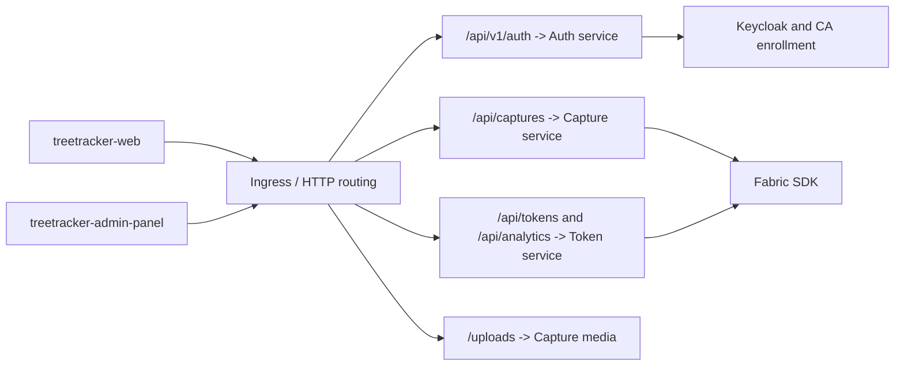

# TreeTracker HTTP routing and API integration

## Architecture and ownership

The browser applications call three existing backend APIs through platform
ingress/routing. This directory documents that contract; it deploys no new REST
gateway or API microservice. The shared routing belongs to
[treetracker-webapp-mvp-platform](https://github.com/HLF-Enterprise-Blockchain/treetracker-webapp-mvp-platform).

The current admin-panel browser client uses same-origin paths. Route those paths
on the UI's host, or explicitly adapt and test the client configuration; merely
creating separate API hostnames does not satisfy same-origin requests.
Public frontend environment variables are browser-visible and must never contain
Fabric keys or registry/database credentials.

## Application route catalog

Paths are from inspected Express routers and their mount points. This is a
source-level catalog, not an HTTP conformance-test report.

| Service | Method / route | Function |
| --- | --- | --- |
| Auth | POST /api/v1/auth/register | Register account; attempt Fabric enrollment |
| Auth | POST /api/v1/auth/admin/register | Secret-protected administrative registration |
| Auth | POST /api/v1/auth/login; /admin/login | User / admin login |
| Auth | POST /api/v1/auth/refresh; /logout | Session refresh / logout |
| Auth | GET, PUT /api/v1/auth/profile | Read / update caller profile |
| Auth | GET, PUT /api/v1/auth/settings | Read / update caller preferences |
| Auth | GET /api/v1/auth/admin/users/:id | Admin account lookup |
| Auth | POST /api/v1/auth/fabric/enroll | Explicit enrollment attempt |
| Auth | GET /api/v1/auth/fabric/identity | Enrollment status |
| Capture | POST, GET /api/captures | Create or list captures |
| Capture | GET /api/captures/admin; /admin/:id | Administrative capture views |
| Capture | GET /api/captures/:id | Capture detail |
| Capture | PUT /api/captures/:id/approve | Approve/reject using a boolean decision |
| Capture | GET /api/captures/:id/history | Attempt blockchain history query |
| Capture | DELETE /api/captures/:id | Application deletion route; not erasure of committed block history |
| Capture | GET /api/captures/species/suggest | Species suggestions |
| Capture | POST /api/captures/validate | Tree-data validation |
| Token | GET, POST /api/tokens | List or issue tokens |
| Token | GET /api/tokens/:id | Token detail |
| Token | POST /api/tokens/:id/mature | Maturity transition |
| Token | POST /api/tokens/transfer | Ownership transfer |
| Token | GET /api/tokens/wallets/:userId/balance | Wallet statistics |
| Analytics | GET /api/analytics/metrics; /impact; /dashboard | Token/impact/dashboard views |

## Authentication and business authorization

Auth routes manage sessions through Keycloak. Capture routes use flexible
bearer/session middleware; approval explicitly requires the `admin` role.
Token middleware can validate through the configured auth service's profile API;
its alternative path uses a configured JWT verification secret.

The token issuance and maturity handlers inspected attach authentication but not
the available role-authorization middleware. Their comments are not enforcement.
The create-token handler checks required identifiers and duplicate capture linkage,
but does not itself prove that the referenced capture was approved.

Keep admin-registration credentials server-side. A namespace's Kubernetes access,
an application admin role and a Fabric MSP identity are separate capabilities.

## Response and failure semantics

- A successful account-registration response does not guarantee Fabric enrollment.
- A capture request may have a committed Fabric transaction even if a later
  PostgreSQL update fails or the request times out.
- A token issuance response can return a database token after a failed Fabric call.
- An application record deletion cannot remove a transaction from Fabric block history.
- A chaincode query helper may return an empty/null result after catching an error;
  distinguish not-found from unavailable/unauthorized before presenting evidence.

Clients should preserve returned identifiers, display pending/failed ledger status
where available and use a reviewed reconciliation process for ambiguous writes.

## Media and operational routing

Capture upload bytes are stored outside the ledger and served through the capture
service's `/uploads` route. The chaincode adapter stores a URL, not an image-content
hash. Preserve media storage and stable URL routing in backup/restore plans.

Fabric gRPC ports are not REST endpoints. Browsers must not be pointed at peers,
orderers, chaincode, CouchDB or the orderer admin API. TLS termination, CORS,
request-size controls, session handling and ingress configuration remain platform
and service responsibilities.

See [microservice architecture](../../README.md#microservices-and-their-functions),
[Node.js integration](../nodejs/README.md), and the
[deployment guide](../../docs/TREETRACKER_DEPLOYMENT_GUIDE.md).
