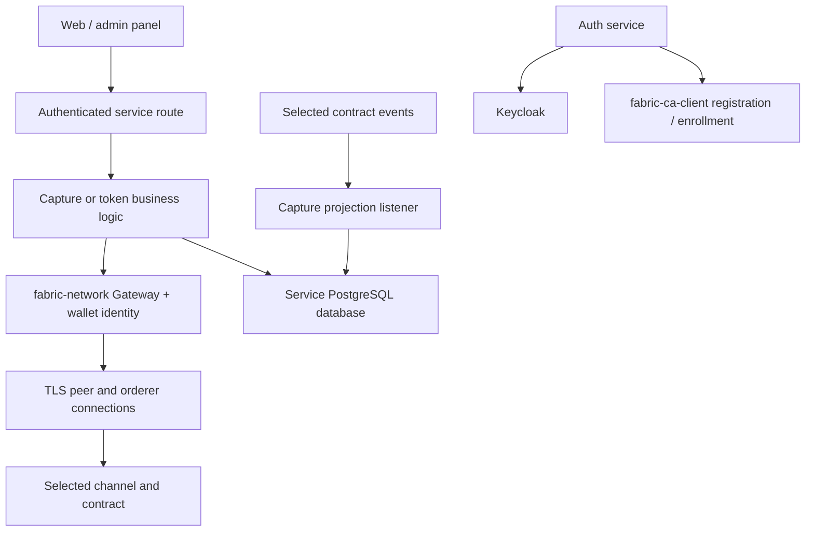

# Node.js microservice integration with TreeTracker Fabric

## Scope and service ownership

This is the integration guide for the existing Node.js/TypeScript backend
services. It is not a new npm application or a second gateway implementation.
The services remain in their own repositories; this repository supplies their
Fabric infrastructure dependencies.

| Service | Key modules | Responsibilities |
| --- | --- | --- |
| treetracker-auth-service | controllers/auth.controller.ts; config/fabric.config.ts; services/fabric.service.ts | Keycloak account/session API, CA enrollment, identity-status lookup and internal SDK helpers |
| treetracker-capture-service | routes/captures.ts; fabric/fabricClient.ts; services/fabricListener.ts | Capture validation/upload, tree transactions, PostgreSQL view and selected event ingestion |
| greenstand-token-service | services/TokenService.ts; services/FabricService.ts; middleware/auth.ts | Token/ownership/database operations, Fabric token transactions and caller authentication |

Paths above are beneath each service's `src/`; revision links are in the
[root source inventory](../../README.md#evidence-and-implementation-boundaries).

## High-level integration

## Identity model

The reviewed backend SDK integration uses `fabric-network` and Fabric CA client
enrollment. User login is a Keycloak/bearer-token operation. The capture service
currently signs ledger submissions using its service admin identity, carrying
the request user's ID as metadata. The token service uses its configured wallet
identity. Those signatures are different from the user's HTTP token.

Registration can complete when the separate enrollment attempt fails. Check
the enrollment-status API rather than inferring a usable wallet entry from login.
The auth service's general transaction helpers are not exposed as generic
HTTP transaction routes by the inspected auth router.

## Configuration contract

| Setting | Expected relationship |
| --- | --- |
| FABRIC_CHANNEL_NAME | Capture/token currently use treetracker-v2 |
| FABRIC_CHAINCODE_NAME | tree-contract for capture; token-contract for tokens |
| FABRIC_MSP_ID | GreenstandMSP in the inspected backend deployments |
| FABRIC_PEER_URL | TLS peer endpoint, currently peer0-greenstand:7051 |
| FABRIC_ORDERER_URL | Matching active ordering group, currently v2-orderer0:7050 |
| FABRIC_ORDERER_TLS_CA_CERT_PATH | Mounted issuing root for the chosen orderer |
| FABRIC_GREENSTAND_PEER_TLS_CA_CERT_PATH | Mounted Greenstand peer TLS root |
| FABRIC_CBO_PEER_TLS_CA_CERT_PATH | Mounted CBO peer TLS root used by the connection profile |
| FABRIC_ORDERER_TLS_HOSTNAME_OVERRIDE | If set, must match an actual certificate SAN |
| CA / admin / wallet settings | External enrollment credentials and durable, scoped signing identities |

Use full in-cluster DNS names from the network charts. Configuration in service
source defaults may differ from actual deployment overrides; the capture source,
for example, has an MSP-name fallback different from the live GreenstandMSP
override. Do not copy fallback values into production unchecked.

The live auth service has `treetracker-channel` / `treetracker` configured,
not the capture/token channel/contract pair. Enrollment does not require selecting
a channel, but using its ledger helper methods requires deliberate alignment.

## Data consistency and events

Capture creation submits to Fabric before its PostgreSQL upsert. A later database
failure can leave a committed ledger observation missing from the application
view. The listener attempts projection updates for selected events, but durable
replay was not established.

Token issuance begins a database transaction, attempts MintToken, records a
completed or failed transaction outcome, and can commit the database record in
either case. Maturity/transfer catch Fabric errors too. Application retry and
reconciliation must preserve capture IDs, ledger IDs, token IDs and transaction
IDs; blindly issuing a second token is not a recovery mechanism.

These services are not participating in a shared database/Fabric atomic commit.
Any future outbox, replay worker or idempotency scheme needs implementation and
tests in the owning service, not a documentation-only claim here.

## Connectivity and acceptance

Backend namespaces must match the Fabric client NetworkPolicy selector.
Authorize DNS and service traffic, supply trust bundles and confirm registry,
wallet and database prerequisites independently. A service health endpoint may
be available without a usable Fabric connection.

Before releasing a service, verify authentication and roles, enrollment status,
TLS chains, channel membership, package/CCID alignment, actual contract methods,
event payload compatibility, ledger commit status and recovery after a partial
database/Fabric failure. This README provides an integration contract, not a
claim that those acceptance tests have run.

See [HTTP gateway boundaries](../gateway/README.md),
[contract mapping](../../chaincode/treetracker/README.md), and
[operator integration commands](../../docs/TREETRACKER_INTEGRATION_MANUAL.md).
