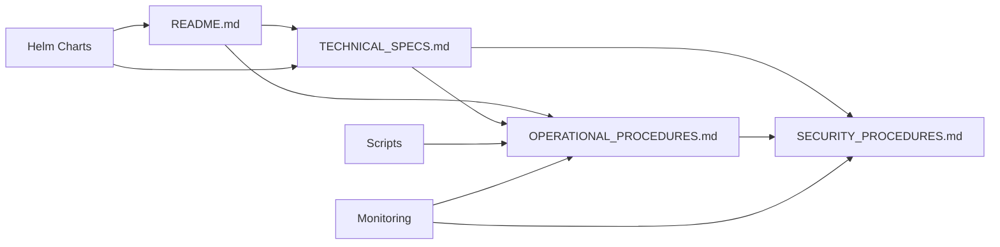

# CA Infrastructure Documentation Index

## Document Overview

This directory contains comprehensive documentation for the Hyperledger Fabric Certificate Authority infrastructure. The documentation is organized into several key areas covering different aspects of CA management and operations.

## Documentation Structure

### 📋 Core Documentation

| Document | Purpose | Audience | Last Updated |
|----------|---------|----------|--------------|
| [`README.md`](README.md) | Overview and quick start guide | All users | 2024-09-02 |
| [`TECHNICAL_SPECS.md`](TECHNICAL_SPECS.md) | Technical specifications and architecture | Engineers, Architects | 2024-09-02 |
| [`OPERATIONAL_PROCEDURES.md`](OPERATIONAL_PROCEDURES.md) | Daily operations and maintenance | Operations Teams | 2024-09-02 |
| [`SECURITY_PROCEDURES.md`](SECURITY_PROCEDURES.md) | Security protocols and incident response | Security Teams | 2024-09-02 |

### 📁 Directory Documentation

| Component | Location | Documentation |
|-----------|----------|---------------|
| **Helm Charts** | `helm-charts/` | Individual chart README files |
| **Scripts** | `scripts/` | Script headers and inline documentation |
| **Fabric CA Configs** | `fabric-ca/` | Configuration file comments |
| **Certificate Monitor** | `../monitoring/` | Integration documentation |

## Quick Reference Guide

### 🚀 Getting Started

**New to CA infrastructure?**
1. Start with [`README.md`](README.md) for overview and quick start
2. Review [`TECHNICAL_SPECS.md`](TECHNICAL_SPECS.md) for architecture understanding
3. Follow deployment procedures in scripts documentation

**Operations team?**
1. Focus on [`OPERATIONAL_PROCEDURES.md`](OPERATIONAL_PROCEDURES.md)
2. Review daily/weekly/monthly procedures
3. Familiarize with troubleshooting procedures

**Security team?**
1. Study [`SECURITY_PROCEDURES.md`](SECURITY_PROCEDURES.md)
2. Review incident response procedures
3. Understand compliance requirements

### 🔍 Common Tasks

| Task | Primary Document | Supporting Documents |
|------|------------------|---------------------|
| **Deploy new CA** | README.md | TECHNICAL_SPECS.md |
| **Certificate renewal** | OPERATIONAL_PROCEDURES.md | SECURITY_PROCEDURES.md |
| **Backup/restore** | OPERATIONAL_PROCEDURES.md | TECHNICAL_SPECS.md |
| **Incident response** | SECURITY_PROCEDURES.md | OPERATIONAL_PROCEDURES.md |
| **Performance tuning** | TECHNICAL_SPECS.md | OPERATIONAL_PROCEDURES.md |
| **Security hardening** | SECURITY_PROCEDURES.md | TECHNICAL_SPECS.md |

## Document Contents Summary

### [`README.md`](README.md)
- **Overview**: CA infrastructure introduction and architecture
- **Quick Start**: Step-by-step deployment guide
- **Directory Structure**: File and folder organization
- **Basic Operations**: Common commands and procedures
- **Troubleshooting**: Common issues and solutions
- **Integration**: How CA integrates with other systems

### [`TECHNICAL_SPECS.md`](TECHNICAL_SPECS.md)
- **System Architecture**: Technical design and component relationships
- **Container Specifications**: Resource requirements and configurations
- **Network Configuration**: Security, ports, and communication
- **API Documentation**: REST APIs and CLI commands
- **Performance Metrics**: Scalability limits and capacity planning
- **Configuration Management**: Environment variables and ConfigMaps
- **Version Management**: Upgrade procedures and compatibility

### [`OPERATIONAL_PROCEDURES.md`](OPERATIONAL_PROCEDURES.md)
- **Standard Operating Procedures**: Daily, weekly, monthly tasks
- **Incident Response**: Emergency procedures and escalation
- **Maintenance Procedures**: Planned maintenance and updates
- **Monitoring Procedures**: Health checks and performance monitoring
- **Backup/Restore**: Complete data protection procedures
- **Change Management**: Configuration and version changes

### [`SECURITY_PROCEDURES.md`](SECURITY_PROCEDURES.md)
- **Security Framework**: Objectives and access control
- **Cryptographic Security**: Key management and certificate validation
- **Network Security**: Segmentation and TLS configuration
- **Incident Response**: Security incident classification and response
- **Compliance**: Audit procedures and regulatory requirements
- **Security Hardening**: Container and network security measures

## Documentation Maintenance

### 📝 Update Schedule

| Document Type | Update Frequency | Trigger Events |
|---------------|------------------|----------------|
| **README.md** | Quarterly | Major feature additions, structural changes |
| **TECHNICAL_SPECS.md** | Bi-annually | Version upgrades, architecture changes |
| **OPERATIONAL_PROCEDURES.md** | Monthly | Process improvements, new procedures |
| **SECURITY_PROCEDURES.md** | Quarterly | Security policy changes, incident learnings |

### ✍️ Contributing to Documentation

#### Documentation Standards
- **Format**: Markdown with consistent styling
- **Code Blocks**: Include language identifiers and executable examples
- **Version Control**: All changes tracked in git
- **Review Process**: Technical review required for procedure changes

#### Update Process
1. **Identify Changes**: Document what needs updating
2. **Draft Updates**: Create updated content following standards
3. **Technical Review**: Review for accuracy and completeness
4. **Security Review**: Security procedures require security team review
5. **Approval**: Platform lead approval for operational changes
6. **Deployment**: Update files and notify relevant teams

### 🔄 Document Relationships

## Additional Resources

### 🔗 External References

| Resource | Link | Purpose |
|----------|------|---------|
| **Hyperledger Fabric CA Documentation** | [Official Docs](https://hyperledger-fabric-ca.readthedocs.io/) | Official reference |
| **Kubernetes Documentation** | [k8s.io](https://kubernetes.io/docs/) | Platform reference |
| **Helm Documentation** | [helm.sh](https://helm.sh/docs/) | Deployment tools |
| **Security Best Practices** | [NIST Framework](https://www.nist.gov/cyberframework) | Security guidelines |

### 📞 Support and Contact

| Type | Contact | Purpose |
|------|---------|---------|
| **Technical Support** | Platform Team | Infrastructure issues |
| **Security Issues** | Security Team | Security incidents, vulnerabilities |
| **Documentation Updates** | Documentation Team | Content improvements |
| **Emergency Escalation** | On-call Manager | Critical incidents |

## Version History

| Version | Date | Changes | Author |
|---------|------|---------|--------|
| 1.0 | 2024-09-02 | Initial documentation creation | System |
| | | Complete CA infrastructure documentation | |
| | | Security procedures and compliance | |
| | | Operational procedures and monitoring | |

## Compliance and Governance

### 📋 Document Classification
- **README.md**: Internal Use
- **TECHNICAL_SPECS.md**: Internal Use
- **OPERATIONAL_PROCEDURES.md**: Internal Use
- **SECURITY_PROCEDURES.md**: Confidential

### 🔒 Access Control
- **Read Access**: All development and operations team members
- **Write Access**: Platform leads, documentation maintainers
- **Security Docs**: Security team approval required for changes

### 📊 Usage Analytics
- Documentation access patterns monitored
- Most frequently accessed sections identified
- User feedback collected for improvements

This documentation index provides a comprehensive overview of all CA infrastructure documentation, helping users quickly find the information they need for their specific roles and tasks.
