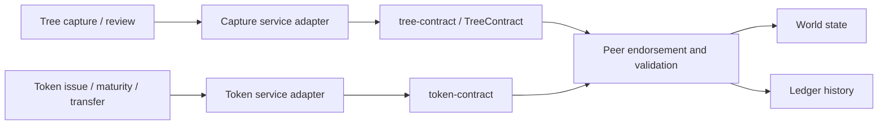

# Tree and impact-token contract integration

## Purpose

TreeTracker's contracts receive endorsed business operations for tree observations
and impact tokens. They execute through two external Fabric chaincode services.
The service deployment belongs in [k8s/chaincode](../../k8s/chaincode/README.md);
this directory explains the business interface expected by the application code.

No replacement Go implementation is supplied here. The pinned service images
already exist in a private registry, and exact source-to-image provenance has
not been established. Import authoritative, reviewed Go source separately before
claiming that this repository builds or fully specifies the deployed contracts.

## Contract interaction architecture

## Observed caller method map

These names come from the source reviewed in the
[root evidence table](../../README.md#evidence-and-implementation-boundaries).
They are caller expectations, not an asserted ABI or a successful runtime test.

| Adapter | Operation | Method name | Payload/result interpretation |
| --- | --- | --- | --- |
| Capture | Record observation | PlantTree | JSON species, location, timestamp and selected metadata; result may provide canonical tree ID |
| Capture | Review decision | updateCaptureStatus | Ledger capture ID and approval boolean serialized as a string |
| Capture | Read capture | queryCapture | Capture ID; query helper parses JSON |
| Capture | List by user | queryCapturesByUser | User ID |
| Capture | Read history | getCaptureHistory | Capture ID |
| Token | Issue impact token | MintToken | JSON token ID, name/symbol, amount, recipient, tree ID and metadata |
| Token | Maturity/state update | UpdateTokenMetadata | Token ID and JSON state/value |
| Token | Transfer | TransferToken | JSON token ID, recipient, amount and transfer-purpose text |
| Token | Read token | GetToken | Token ID |

The capture adapter first asks for the named `TreeContract` and has a default
contract fallback. Function names are case-sensitive; verify compatibility
against the committed definition and actual contract before enabling a flow.

## Capture data and event behavior

The HTTP capture schema is richer than the `PlantTree` payload. Photographs are
uploaded separately; selected media URLs and user identifiers are put in metadata.
The current adapter uses the capture timestamp for its on-chain plantingDate.
Do not treat the ledger as storing every submitted measurement or the media bytes.

The listener looks for `TreePlanted` and `CaptureStatusUpdated` events and
upserts application rows when its expected identifiers are present.
Test event name/payload compatibility, duplicate handling and restart/replay
behavior; the source inspection does not establish durable replay checkpoints.

## Token behavior and application reconciliation

Approval and token issuance are separate requests. Token creation has an
application duplicate-capture check but the inspected route does not itself
validate capture approval. Issuance, maturity and transfer have database/Fabric
consistency boundaries detailed in the root README. A database token is not
proof of a committed MintToken transaction.

Impact factors are service-supplied estimates. Neither the contract's presence
nor a token symbol establishes independently certified ecological outcomes.

## Packaging and release procedure

1. Obtain the reviewed contract image and its immutable digest.
2. Obtain its server certificate and trusted issuing root.
3. Package the correct Service DNS/port and TLS root using
   `scripts/deploy-chaincode.sh package`.
4. Use the calculated package ID as `CHAINCODE_CCID` for that service.
5. Install on each intended endorsing peer.
6. Approve an identical definition from the required organizations, inspect
   readiness, then commit the reviewed sequence.
7. Verify evaluate/submit behavior, authorization, emitted events and commit status.

Repackaging with changed TLS or endpoint content changes the package hash.
Do not assume the default observed CCIDs match freshly generated packages.
For existing ledgers, restore matching package artifacts or perform a governed
upgrade; service restart alone does not migrate contract definitions.

See the [integration manual](../../docs/TREETRACKER_INTEGRATION_MANUAL.md) for
executable commands and the [peer chart](../../k8s/peers/README.md) for the external
builder. Private MSP material and package recovery artifacts remain outside Git.
