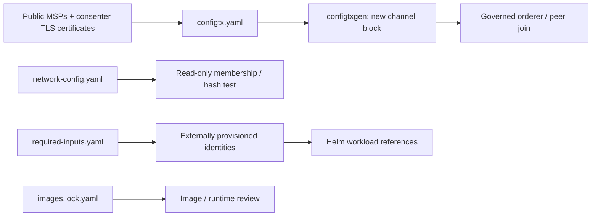

# TreeTracker network configuration

## Purpose and ownership

These files describe the Fabric topology, channel profiles, image baseline and
external identity contract consumed by the six charts and management scripts.
Application HTTP routes, Keycloak realms and PostgreSQL schemas remain in the
owning service repositories.

## Configuration map

| File | Function | Consumer / change impact |
| --- | --- | --- |
| configtx.yaml | Application-channel profiles for original and successor groups | configtxgen; new channel blocks only |
| crypto-config.yaml | Development cryptogen organization/node topology | Isolated validation fixtures; not production CA enrollment |
| network-config.yaml | Organizations, peers, channels, contract names and observed baseline | Read-only network test and operator reference |
| required-inputs.yaml | External Secret/ConfigMap names and required keys | Operator provisioning contract; checked against chart render |
| images.lock.yaml | Observed immutable image digests and provenance | Review and release reproducibility |



## Organization and channel relationship

Greenstand has three peers, CBO two, Investor two and Verifier one.
The two supplied profiles include CBO and Greenstand, matching the current
participating organizations. Investor and Verifier definitions are available but
are not automatically included or joined.

`TreetrackerChannel` targets `orderer0..4`; `TreetrackerV2Channel` targets
`v2-orderer0..4`. Each profile has five consenters with explicit TLS certificates.
Changing a YAML profile does not modify an existing channel.

The application capture/token services target `treetracker-v2` with
`tree-contract` and `token-contract`. Auth's inspected SDK defaults in the
live deployment differ; enrollment is independent, but ledger helper use must
be aligned deliberately. See the [integration contract](../README.md#api-and-fabric-integration-contract).

## Public cryptographic inputs

Populate ignored `msp/{cbo,greenstand,orderer}` directories with public
organization MSP material: CA/intermediate certificates as applicable, admin
certificates when required, and NodeOU configuration. Configtxgen does not need
the private administrative signing keys.

Populate ignored `consenters/{orderer0..4,v2-orderer0..4}-tls.pem` with the
actual consenter server certificates. Service FQDNs, certificate SANs and
profile endpoints must agree. Application TLS trust bundles and MSP identities
must agree with the channel's admitted roots.

The development crypto configuration uses separate peer-organization domains
and includes service DNS SANs. It generates new identities for tests; those
identities cannot substitute for an existing channel's authorities.

## Safe configuration workflows

1. Render charts and list the referenced external inputs.
2. Review changes to image digests, identities, Service DNS and persistent claims.
3. For new channels, prepare public MSPs/certificates and compile the selected profile.
4. For existing channels, use authentic blocks and governed configuration updates.
5. Validate application endpoint/channel/contract configuration and test business flows.

The isolated `scripts/test-config.sh` generates temporary test identities in a
network-disabled container and compiles both profiles. It does not certify real
identity trust or reproduce historic configuration blocks.

These files contain no credentials or production genesis blocks. Never regenerate
genesis for an existing ledger during recovery. Preserve original data and use
the [migration guide](../docs/MIGRATION.md).

## Useful commands

From the repository root:

```bash
./scripts/preflight.sh
./scripts/render.sh --profile production
./scripts/create-channels.sh generate --channel treetracker-v2 --block /secure/artifacts/treetracker-v2.block
./scripts/test-config.sh
```

The channel command prints its plan unless `--execute` is supplied. The isolated
profile test requires the exact tools image already installed locally.
See [deployment](../docs/TREETRACKER_DEPLOYMENT_GUIDE.md) and
[contract lifecycle](../docs/TREETRACKER_INTEGRATION_MANUAL.md).
