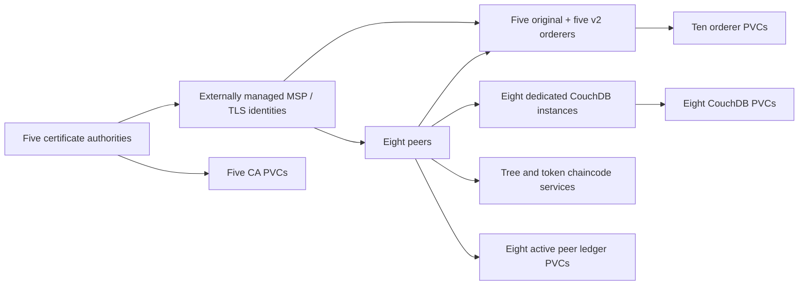

# TreeTracker Fabric architecture

## Topology

| Organization | MSP ID | CA | Peers |
| --- | --- | --- | --- |
| Greenstand | GreenstandMSP | greenstand-ca | peer0, peer1, peer2-greenstand |
| Community organizations | CboMSP | cbo-ca | peer0, peer1-cbo |
| Investors | InvestorMSP | investor-ca | peer0, peer1-investor |
| Verifiers | VerifierMSP | verifier-ca | peer0-verifier |

`fabric-root-ca` is the fifth CA. The observed organization CAs start independently;
their deployment labels say `intermediate-ca`, but that label is not evidence of
a cryptographic parent chain. The charts preserve independent CA operation.
A hierarchical CA rollout requires explicit parent enrollment configuration,
intermediate certificates, and consistent channel MSP trust; do not infer it from
the root CA's existence.

The two ordering groups each have five separate identities, PVCs and services.
`orderer0..4` serve the original network; `v2-orderer0..4` serve the successor.
Both use Fabric's channel participation API, with `BootstrapMethod: none`.
Orderers start without a channel on empty storage until an authentic channel
block is joined through the administration API.

The current active channel joins the three Greenstand and two CBO peers.
Investor and Verifier workloads are provisioned but unjoined. Adding them
requires a governed channel configuration update and chaincode policy review.

## Storage and failure domains

| Data | Claims | Requested capacity | Mount |
| --- | --- | --- | --- |
| CA keys, certificates, registry/database | 5 | 13 GiB | `/var/hyperledger/fabric-ca-server` |
| Orderer ledger, Raft WAL and snapshots | 10 | 50 GiB | `/var/hyperledger/production/orderer` |
| CouchDB state databases | 8 | 40 GiB | `/opt/couchdb/data` |
| Current peer ledgers and installed chaincode packages | 8 | 80 GiB | `/var/hyperledger/production` |
| Previous peer ledgers | 8 | 80 GiB | Unmounted, retained for recovery |

PVC names are kept from the reference deployment, but bindings and node paths
are not exported. The default `fabric-retained` StorageClass must be provided by
the platform. Require encrypted CSI storage, Retain reclamation and
WaitForFirstConsumer scheduling. The live kind `do-block-storage` class is local
hostPath storage and does not provide host-loss resilience.

Production orderers use required anti-affinity within each ordering group, on
`kubernetes.io/hostname`; each group needs five schedulable nodes. Place those
nodes across suitable failure domains in your cluster. Two PDBs preserve three
available orderers per group during voluntary eviction. PDBs do not serialize
Deployment upgrades or prevent involuntary failures. Each stateful singleton
also has a minAvailable=1 PDB: a node drain needs an explicit maintenance plan.

Peers use OnDelete updates to avoid automatically replacing every peer at once.
CA, orderer and CouchDB Deployments use Recreate to avoid concurrent writers to
one identity's RWO claim. Workload replacement must be coordinated by operators.

## Identity and network boundaries

All runtime identities and registry credentials are external Kubernetes Secrets.
`config/required-inputs.yaml` lists only object names and required keys. The two
public current-root ConfigMaps are external too, so this repository does not
silently bind a new cluster to the old CA roots. Certificate renewal controllers
are intentionally not installed here. Secret subPath mounts require a deliberate
pod restart after rotations; a Secret update alone does not refresh those files.

Peers and orderers expose TLS on their transaction endpoints. Chaincode services
also use TLS. Orderer administration on 9444 additionally requires a client
certificate issued by the root in `orderer-admin-client-ca/ca.crt`; keep this trust
separate from ordinary client identities.

NetworkPolicies allow Fabric component traffic between the three Fabric
namespaces, DNS to kube-system, client transaction traffic from namespaces
labeled `fabric.treetracker.io/client=true`, administration from namespaces
labeled `fabric.treetracker.io/admin=true`, and metrics access from namespaces
labeled `fabric.treetracker.io/monitoring=true`. The CNI must enforce policies.
NodeLocal DNS or external dependencies require reviewed egress overrides.
The metrics endpoints themselves use HTTP inside the cluster. No ingress,
LoadBalancer or public admin endpoint is created.

Runtime service accounts do not mount API tokens and have no Roles or bindings.
Container privilege escalation is disabled, capabilities are dropped, and the
pod seccomp profile is RuntimeDefault. Live-compatible peer/orderer/CA/CouchDB
UIDs are retained. The private chaincode image UID remains image-defined and
must be reviewed before enforcing a stricter cluster Pod Security admission level.

## Images and upgrades

Images are pinned to live imageID digests in `config/images.lock.yaml`. This
includes private images in DigitalOcean/GHCR; access credentials and cross-region
availability must be arranged separately. The private orderer image happens to
be stored under `treetracker-web`, but its running binary reports Fabric 2.5.4.
Peers report 2.5.16 and CAs use 1.5.7. Pinning records provenance and repeatability;
it does not establish vulnerability status or certify this mixed-version baseline.

Choose and test an approved uniform Fabric release before production rollout.
Changing software versions, CA trust, channel config, or chaincode sequence is
a separate reviewed change. Updating Helm values does not update channel policy.
