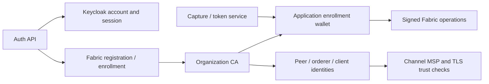

# Fabric certificate authorities for TreeTracker

## Business role

TreeTracker needs to distinguish a planter's account, a backend's signing
identity and a member organization's peers. Fabric CAs register and enroll
certificate identities used by the latter two. The auth service integrates
with Fabric CA for user enrollment; capture and token services load/enroll
their configured wallet identity before making ledger calls.

A Fabric certificate does not replace the Keycloak access token, and issuing
one does not itself admit an organization to a channel.

## Topology and ownership

| CA Deployment | Service | TLS port | PVC |
| --- | --- | --- | --- |
| fabric-root-ca | fabric-root-ca-service | 7054 | fabric-root-ca-pvc, 5 GiB |
| cbo-ca | cbo-ca-service | 7055 | cbo-ca-pvc, 2 GiB |
| investor-ca | investor-ca-service | 7056 | investor-ca-pvc, 2 GiB |
| verifier-ca | verifier-ca-service | 7057 | verifier-ca-pvc, 2 GiB |
| greenstand-ca | greenstand-ca-service | 7058 | greenstand-ca-pvc, 2 GiB |

All resources are in `hlf-ca`. Each service also exposes operations on 9443.
The chart creates five Deployments, five Services and five service accounts,
plus production policy/PDB resources. The storage chart creates the five PVCs.

The live-compatible organization CA startup is independent-root operation.
The labels `intermediate-ca` do not configure a parent certificate chain.
A hierarchical PKI requires explicit parent enrollment and corresponding MSP
trust changes; do not infer it from the fifth, root-named CA.

## Enrollment architecture



## Configuration and identity inputs

The pinned CA image is in `values.yaml`; identity inputs are external.
Each `<ca-name>-bootstrap` Secret must provide `username` and `password`.
The CA home at `/var/hyperledger/fabric-ca-server` holds durable signing keys,
certificates, database and configuration. Initialization occurs only if its
configuration file does not yet exist; subsequent restarts reuse that home.

Customize `nodes.<name>.pod.containers.fabric-ca-server.env` for endpoint/CA
settings and `resources` for capacity. Keep CSR SANs aligned with actual
service DNS. Parent enrollment, if introduced, must use Secret-backed credentials.
Changing a bootstrap Secret does not rotate an existing CA's stored authority.

## Application integration and failure behavior

- Auth registration may succeed even when its separate Fabric enrollment fails.
  Query enrollment status before relying on the account's wallet entry.
- Capture/token business calls require their own usable wallet identity and
  correctly trusted peer/orderer certificates.
- Renewing a certificate does not update a channel's trusted root automatically.
- A new CA home produces a different authority and cannot restore a lost signing key.

## Operations and recovery

Check CA pod readiness, HTTPS CA responses, enrollment failures and certificate
expiry. Back up the full CA home and recover it consistently with channel trust.
Never recover a mature network by silently initializing an empty CA volume.
Production singleton PDBs affect node drains. CA metrics remain built in; the
old certificate-exporter sidecars are outside this chart's deployment scope.

## Helm usage and repository map

Run from the repository root:

```bash
./scripts/render.sh --component ca --profile production
./scripts/preflight.sh --component ca
./scripts/validate.sh --component ca --profile production
# After external inputs, storage and ownership are reviewed:
./scripts/deploy-treetracker-network.sh --component ca --context production --apply
```

`Chart.yaml` defines this release; `values.yaml` contains shared defaults and
named node overrides; `values.schema.json` validates value shape;
`values-kind.yaml` holds local relaxations; `templates/` renders the resources.
The kind profile disables policies/PDBs; orderer placement relaxations apply
only to the orderer chart. Rendering and preflight without `--live` are local.
For a live prerequisite check, add an explicit `--context` and `--live`.

See the [platform architecture](../../README.md#high-level-platform-architecture),
[deployment guide](../../docs/TREETRACKER_DEPLOYMENT_GUIDE.md),
[migration guide](../../docs/MIGRATION.md), and
[validation evidence](../../docs/VALIDATION.md).
