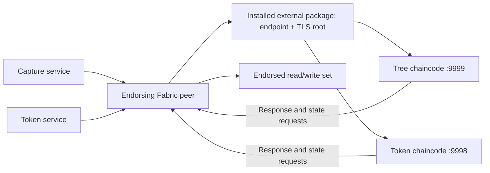

# TreeTracker external chaincode services

## Business role

The services execute contract code for tree observations and impact tokens when
invoked by Fabric peers. They do not expose TreeTracker's browser REST API.
HTTP validation, session authorization, image upload and PostgreSQL bookkeeping
belong to the application services.

| Deployment / Service | TLS port | Backend consumer | Fabric definition |
| --- | ---: | --- | --- |
| tree-contract-chaincode | 9999 | treetracker-capture-service | tree-contract |
| token-contract-chaincode | 9998 | greenstand-token-service | token-contract |

Namespace: `hlf-peer-org`. Both Deployments use pinned versions of the existing
private chaincode images. Exact source-to-image provenance was not established;
the [contract integration guide](../../chaincode/treetracker/README.md) records
the method names observed in backend adapters without inventing a Go implementation.

## Execution architecture



## Runtime identity and lifecycle

`CHAINCODE_CCID` must equal the calculated ID of the package installed on peers.
`CHAINCODE_ADDRESS` configures the internal listener; TLS certificate/key paths
reference the `chaincode-tls` or `token-chaincode-tls` Secret. Both require
`tls.crt` and `tls.key`. Registry access uses the external
`registry-treetracker-registry` pull Secret.

A service pod, an installed package and a channel-committed definition are three
different things. The Helm chart deploys the service. The lifecycle script
packages, installs, approves, checks readiness and commits through explicit
operator commands. Rebuilding a package with a different CA or endpoint changes
its ID; update the matching service CCID and approvals as appropriate.

Neither service owns a PVC. Durable contract data is maintained by peers and
their ledgers/world state. Replacing a service container does not migrate
contract state or increment a channel definition's sequence.

## TreeTracker integration contract

The inspected capture adapter submits `PlantTree` and `updateCaptureStatus`;
its read helpers name `queryCapture`, `queryCapturesByUser` and
`getCaptureHistory`. The token adapter names `MintToken`,
`UpdateTokenMetadata`, `TransferToken` and `GetToken`.
These are observed caller expectations, not a verified ABI of the pinned images.

Approval and minting are separate application requests. The services do not
provide an automatic environmental verification or token-issuance workflow.
Token API/database success must be reconciled with Fabric commit status.

## Operations

TCP health probes verify listening services; they do not exercise a contract,
policy or state transition. For failures, compare installed package IDs,
runtime CCIDs, service selectors, package TLS roots, certificate SANs and the
committed definition. Test one authorized query and transaction after a release.
Use the integration manual for lifecycle commands and sequence management.

## Helm usage and repository map

Run from the repository root:

```bash
./scripts/render.sh --component chaincode --profile production
./scripts/preflight.sh --component chaincode
./scripts/validate.sh --component chaincode --profile production
# After external inputs, storage and ownership are reviewed:
./scripts/deploy-treetracker-network.sh --component chaincode --context production --apply
```

`Chart.yaml` defines this release; `values.yaml` contains shared defaults and
named node overrides; `values.schema.json` validates value shape;
`values-kind.yaml` holds local relaxations; `templates/` renders the resources.
The kind profile disables policies/PDBs; orderer placement relaxations apply
only to the orderer chart. Rendering and preflight without `--live` are local.
For a live prerequisite check, add an explicit `--context` and `--live`.

See the [platform architecture](../../README.md#high-level-platform-architecture),
[deployment guide](../../docs/TREETRACKER_DEPLOYMENT_GUIDE.md),
[migration guide](../../docs/MIGRATION.md), and
[validation evidence](../../docs/VALIDATION.md).
