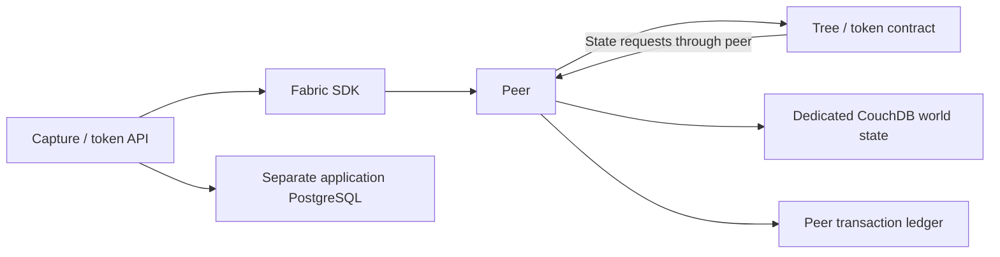

# TreeTracker peer world-state databases

## Business role

Every Fabric peer has an associated CouchDB instance containing its current
contract state. This supports chaincode reads and rich queries while the peer
ledger retains transaction history. TreeTracker's HTTP capture and token
services use application PostgreSQL separately; they must not read or update
CouchDB directly as a shortcut around Fabric validation.

## Inventory and relationship

Eight `<peer>-couchdb` Deployments/Services in `hlf-peer-org` correspond to
the three Greenstand, two CBO, two Investor and one Verifier peer. Each database
uses its own `couchdb-data-<peer>-0` 5 GiB claim: 40 GiB total.
These are eight independent databases, not one shared eight-node CouchDB cluster.



## Configuration and inputs

The chart pins the inspected CouchDB 3.4.3 image by digest. The shared
`couchdb-config` ConfigMap configures single-node operation and authenticated
HTTP access. The `couchdb-credentials` Secret provides `username` and `password`;
the corresponding peers must use the same credentials.

Services expose TCP 5984 only within the cluster. Built-in peer-to-CouchDB
traffic in this baseline uses HTTP protected by namespace NetworkPolicies,
not a claim of database transport TLS. Do not expose these Services publicly.
Private image pulls require `ghcr-pull` in the same namespace.

For per-node resource or image overrides use
`nodes.<peer>-couchdb.pod.containers.couchdb`. Lists such as volumeMounts replace
as a whole; review the resulting render after any volume customization.

## Availability and recovery

Deployments use Recreate to prevent simultaneous writers to a claim.
Startup/readiness/liveness checks establish TCP availability, not successful
authenticated database access or Fabric transaction health. Check peer logs
and committed ledger progress as well.

An unavailable database affects its associated peer's state operations.
Keep organization-level peer redundancy and a controlled maintenance sequence.
Do not independently restore unrelated peer/CouchDB points and assume consistency.
Use supported Fabric state recovery/rebuild procedures from the ledger and
test the combined restore before returning the peer to service.

The storage chart protects claim deletion paths; backup consistency and
off-cluster retention are separate platform responsibilities.

## Helm usage and repository map

Run from the repository root:

```bash
./scripts/render.sh --component couchdb --profile production
./scripts/preflight.sh --component couchdb
./scripts/validate.sh --component couchdb --profile production
# After external inputs, storage and ownership are reviewed:
./scripts/deploy-treetracker-network.sh --component couchdb --context production --apply
```

`Chart.yaml` defines this release; `values.yaml` contains shared defaults and
named node overrides; `values.schema.json` validates value shape;
`values-kind.yaml` holds local relaxations; `templates/` renders the resources.
The kind profile disables policies/PDBs; orderer placement relaxations apply
only to the orderer chart. Rendering and preflight without `--live` are local.
For a live prerequisite check, add an explicit `--context` and `--live`.

See the [platform architecture](../../README.md#high-level-platform-architecture),
[deployment guide](../../docs/TREETRACKER_DEPLOYMENT_GUIDE.md),
[migration guide](../../docs/MIGRATION.md), and
[validation evidence](../../docs/VALIDATION.md).
