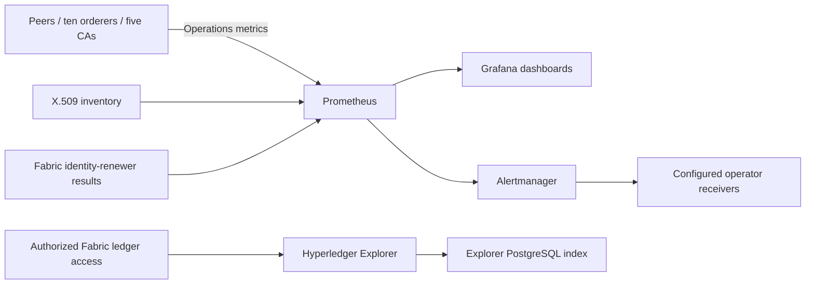

# TreeTracker observability integration

## Scope

This directory documents how the Fabric network feeds the platform's existing
observability services. It contains no monitoring chart or Deployment: this
repository continues to deploy only the six requested Fabric components.

## High-level architecture

## Responsibilities and signals

| Integration | TreeTracker function | Useful evidence |
| --- | --- | --- |
| Prometheus | Collect Fabric operations telemetry | Target availability, block height/progress, endorsement/commit latency, Raft state, CA errors |
| Grafana | Visualize service and ledger behavior | Compare peers within the same channel; inspect original/v2 ordering groups separately |
| Alertmanager | Route and manage actionable alerts | Grouping, inhibition and silences; receiver secrets stay outside Git |
| X.509 inventory | Detect expiring/unreadable certificate sources | MSP, TLS and platform certificate validity |
| Fabric identity renewer | Stage replacement enrollments | Staging outcomes and controlled promotion status |
| Explorer | Investigate blocks/transactions/channels | Ledger transaction IDs associated with captures and tokens |
| Headlamp | Inspect Kubernetes infrastructure | Pod readiness, scheduling and volume conditions |

A browser success response is not a monitoring signal for successful Fabric
commit. Token issuance can record a failed Fabric operation while returning a
database token. Correlate API records, transaction IDs and ledger outcomes.

## Endpoints and access

Peers, orderers and CAs expose built-in operations endpoints on 9443.
Metrics use HTTP within the cluster; the production NetworkPolicies admit
namespaces matching `fabric.treetracker.io/monitoring=true`, or a reviewed
selector override. The core charts do not create Prometheus discovery objects,
Grafana dashboards, alert receivers or namespace labels.

Configure an external scraper for **eight peers, ten orderers and five CAs**.
Retain channel labels when comparing ledger heights. The Helm CA chart omits the
old certificate-exporter sidecar, so a historical scrape target on 9793 must not
be assumed to exist after migration.

## Reading the evidence

1. Establish workload and endpoint availability.
2. Confirm channel membership and matching ledger height/hash among participants.
3. Correlate a capture or token's recorded transaction ID with ledger commit status.
4. Check identity expiry/trust when transport or Readers-policy failures appear.
5. Use an isolated restore/failover test to establish resilience; dashboards alone
   do not establish recoverability.

Explorer's PostgreSQL is a derived index. It cannot replace ledger or identity
backups. cert-manager handles opted-in platform TLS; Fabric CA/renewal workflows
handle Fabric identity trust.

See the [platform dependency map](../../README.md#platform-dependencies),
[peer operations](../peers/README.md), [orderer operations](../orderer/README.md)
and [user manual](../../docs/TREETRACKER_USER_MANUAL.md).
