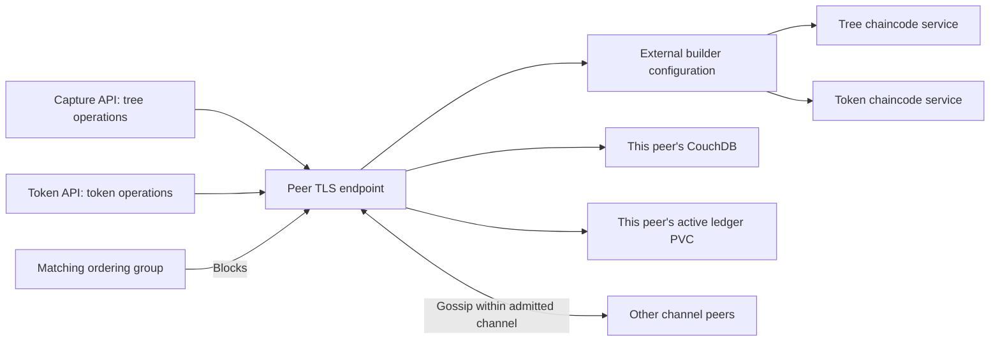

# TreeTracker Fabric peers

## Business role

Peers execute tree/token chaincode proposals, endorse according to organization
policy, receive ordered blocks, validate transactions and maintain ledger history
plus current world state. TreeTracker capture and token backends connect to
peers through the Fabric SDK; the browser frontends only call HTTP APIs.

## Organization inventory

| Organization / MSP | StatefulSets | Provisioned peers | Current channel participation |
| --- | --- | ---: | --- |
| GreenstandMSP | peer0-greenstand, peer1-greenstand, peer2-greenstand | 3 | Original and v2 channels |
| CboMSP | peer0-cbo, peer1-cbo | 2 | Both joined; original channel has trust/policy failures |
| InvestorMSP | peer0-investor, peer1-investor | 2 | None in the inspected reference |
| VerifierMSP | peer0-verifier | 1 | None in the inspected reference |

All eight StatefulSets and their Services are in `hlf-peer-org`. One replica
represents one identity. Adding organization workloads is separate from admitting
that organization's MSP, policy and anchor peers to a channel.

## Peer integration architecture



## Ports and dependencies

- 7051: TLS endorser/Gateway endpoint for application SDKs.
- 7052: peer chaincode endpoint retained in the runtime configuration.
- 9443: internal operations health and metrics.
- Each peer uses its own `<peer>-certs` Secret and `<peer>-config` NodeOU ConfigMap.
- Secret projections require `msp-cert`, `msp-key`, `msp-cacert`,
  `tls-cert`, `tls-key`, `tls-cacert`. NodeOUs classify admins;
  obsolete optional local admincert mounts are omitted.
- Selected peer0 identities additionally reference the external current-root
  ConfigMaps documented in `config/required-inputs.yaml`.
- Each peer references a dedicated CouchDB Service, the shared credential
  contract and its own `peer-ledger-couchdb-<peer>-0` PVC.

The eight old `peer-data-<peer>-0` claims are not mounted. No volumeClaimTemplates
are emitted; storage ownership stays with the storage chart.

## Chaincode service integration

The read-only `fabric-external-builder` ConfigMap supplies executable
`detect`, `build` and `release` scripts. Installed external packages contain
the chaincode endpoint and TLS trust. Their calculated package IDs must match
the runtime service CCIDs. A running peer without an installed package or
committed definition cannot execute that contract.

## Configuration and operations

Override per-node image, resources, gossip bootstrap, MSP/identity references
or endpoints through `nodes.<peer>.pod`. Environment entries are maps in values,
converted to Kubernetes lists by the chart. Use separate identities to add
replicas of an organization's service capacity; never clone one node identity.

Peers use operations health/startup probes and OnDelete updates. A template
change requires an operator-controlled pod replacement. Rotate and verify one
peer at a time; a ready container alone does not establish correct channel
membership or application endorsement.

The read-only network test compares participating peer heights/hashes.
Confirm transaction behavior separately, and treat query failures on the legacy
channel as evidence to investigate, not proof that all channel data is lost.

## Helm usage and repository map

Run from the repository root:

```bash
./scripts/render.sh --component peers --profile production
./scripts/preflight.sh --component peers
./scripts/validate.sh --component peers --profile production
# After external inputs, storage and ownership are reviewed:
./scripts/deploy-treetracker-network.sh --component peers --context production --apply
```

`Chart.yaml` defines this release; `values.yaml` contains shared defaults and
named node overrides; `values.schema.json` validates value shape;
`values-kind.yaml` holds local relaxations; `templates/` renders the resources.
The kind profile disables policies/PDBs; orderer placement relaxations apply
only to the orderer chart. Rendering and preflight without `--live` are local.
For a live prerequisite check, add an explicit `--context` and `--live`.

See the [platform architecture](../../README.md#high-level-platform-architecture),
[deployment guide](../../docs/TREETRACKER_DEPLOYMENT_GUIDE.md),
[migration guide](../../docs/MIGRATION.md), and
[validation evidence](../../docs/VALIDATION.md).
