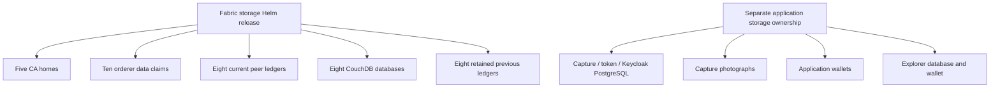

# TreeTracker Fabric persistent storage

## Purpose and deployment ownership

Tree history must survive pod replacement. This chart owns the Fabric PVCs
independently of compute releases, preserving the separation between deployment
lifecycle and ledger/identity retention. Release `fabric-storage` lives in
`hlf-ca`; its claims are explicitly namespaced across `hlf-ca`,
`hlf-orderer` and `hlf-peer-org`.

## Complete 39-claim inventory

| Category | Naming pattern | Count | Per-claim capacity | Total | Consumer |
| --- | --- | ---: | --- | --- | --- |
| Root CA home | fabric-root-ca-pvc | 1 | 5 GiB | 5 GiB | Root CA |
| Organization CA homes | cbo/greenstand/investor/verifier-ca-pvc | 4 | 2 GiB | 8 GiB | Organization CAs |
| Original orderer data | raft-orderer-data-0..4 | 5 | 5 GiB | 25 GiB | Original ordering group |
| Successor orderer data | v2-raft-orderer-data-0..4 | 5 | 5 GiB | 25 GiB | Active ordering group |
| Peer CouchDB state | couchdb-data-<peer>-0 | 8 | 5 GiB | 40 GiB | One database per peer |
| Current peer ledger | peer-ledger-couchdb-<peer>-0 | 8 | 10 GiB | 80 GiB | Eight peer StatefulSets |
| Previous peer ledger | peer-data-<peer>-0 | 8 | 10 GiB | 80 GiB | Retained, unmounted |
| **Total** | | **39** | | **263 GiB** | **31 active + 8 retained claims** |

The exact peer names are listed in [peers](../peers/README.md). No live PV name,
node path, UID or storage binding is embedded in this chart.

## Data ownership architecture



The application storage boxes are integration dependencies, not additional
claims hidden in the 39-count. In particular, a recoverable ledger does not
recover a deleted photograph whose URL appears in a tree record.

## Values and provisioning

| Value | Default | Meaning |
| --- | --- | --- |
| storageClass | fabric-retained | Existing platform CSI class |
| keep | true | Schema requires retention; PVCs receive Helm keep annotation |
| includeLegacy | true | Include all eight old peer claims |
| claims.<name>.create | true | Render this PVC; false references an externally owned existing claim |
| claims.<name>.namespace / size / accessModes | Explicit per claim | Stable ownership and requested storage |

The production class should use encrypted durable CSI storage, Retain reclamation
and WaitForFirstConsumer binding. The chart does not install that class or driver.
The kind overlay names `do-block-storage`, which is node-local in the inspected
cluster despite its name.

Fresh WaitForFirstConsumer claims bind when their pods are scheduled; unmounted
legacy claims can remain Pending. Do not wait for all 39 claims to bind before
starting consumers. `includeLegacy: false` is an explicit new-network choice,
yielding 31 claims; full-inventory validation intentionally expects 39.

## Deployment and migration

From the repository root:

```bash
./scripts/render.sh --component storage
./scripts/preflight.sh --component storage --context production --live
./scripts/deploy-treetracker-network.sh --component storage --context production --apply
```

For an existing network, retain PVC bindings and initially set `create: false`
for claims owned elsewhere. Review [MIGRATION](../../docs/MIGRATION.md) before
changing ownership. StorageClass changes do not migrate existing data, and shrinking
a claim is not supported. A chart edit is not a storage migration procedure.

## Recovery and durability

The keep annotation governs Helm deletion; the PV reclaim policy governs backing
volume disposal. Neither protects against corruption or host loss. Back up CA
homes, orderer ledger/WAL, peer ledger/package state and consistent CouchDB state
through the platform's recovery procedure. Restore authentic keys/channel artifacts
alongside the data, then verify ledger heights/hashes and application transaction
references.

See [architecture](../../docs/TREETRACKER_ARCHITECTURE_GUIDE.md),
[operator manual](../../docs/TREETRACKER_USER_MANUAL.md) and
[platform data ownership](../../README.md#data-ownership-and-consistency).
