# 🔷 What is Hyperledger Fabric?

Hyperledger Fabric is a **permissioned blockchain platform** designed for enterprise-grade use. It supports **modular architecture**, **private transactions**, and **chaincode (smart contracts)**.

---

# 🚀 Why Deploy Hyperledger Fabric on Kubernetes?

Kubernetes (K8s) is ideal for deploying Fabric because it provides:

* **Container orchestration** for managing Fabric components.
* **Scalability**, **high availability**, and **self-healing**.
* **CI/CD integration**, monitoring, and infrastructure automation.

---

# 🧱 Key Fabric Components Deployed on Kubernetes

| Component              | Description                                              |
| ---------------------- | -------------------------------------------------------- |
| **Orderer**            | Manages consensus and ordering of transactions.          |
| **Peer**               | Validates transactions and maintains ledger.             |
| **CouchDB** (optional) | State database for rich queries.                         |
| **Fabric CA**          | Certificate Authority for issuing identities.            |
| **Chaincode**          | Smart contracts run inside Docker containers on Peers.   |
| **ConfigMaps/Secrets** | Store Fabric configuration and crypto material securely. |

---

# 🛠️ Common Kubernetes Tools/Patterns for Fabric

| Tool/Pattern           | Purpose                                                                                |
| ---------------------- | -------------------------------------------------------------------------------------- |
| **Helm Charts**        | Simplifies deployment (e.g., [HLF-Helm Charts](https://github.com/hyperledger/bevel)). |
| **StatefulSets**       | Used for Orderers and Peers that need persistent identity.                             |
| **Persistent Volumes** | For ledger and data storage.                                                           |
| **Ingress/NodePort**   | To expose CA, Orderer, or APIs outside the cluster.                                    |
| **ArgoCD/GitOps**      | For continuous delivery of Fabric infrastructure.                                      |
| **Namespaces**         | Isolate organizations or networks.                                                     |

---

# ⚙️ Deployment Workflow (Simplified)

1. **Generate crypto material** with `cryptogen` or Fabric CA.
2. **Package configurations** (channel, genesis block, etc.).
3. **Deploy CA(s)** via `Deployment` or `StatefulSet`.
4. **Deploy Orderer(s)** with volume mount for ledger.
5. **Deploy Peer(s)** + CouchDB (if used).
6. **Join channel**, install chaincode via CLI or SDK.
7. **Expose endpoints** via Ingress or NodePort for interaction.

---

# ✅ Benefits of Kubernetes for Fabric

* Dynamic scaling of nodes.
* Automated recovery of failed components.
* GitOps-friendly for versioned infrastructure.
* Easier integration with observability (Prometheus/Grafana).
* Secrets management for TLS/certificates.

---

# 📦 Optional Projects/Tools

* **Hyperledger Bevel** – Production-grade Kubernetes automation for Fabric.
* **Hyperledger Explorer** – Web UI for blockchain data visualization.
* **Operator Fabric** – Experimental operator for managing Fabric resources.

# 🧱 Hyperledger Fabric on Kubernetes – Architecture Diagram

This diagram represents a simplified deployment architecture of Hyperledger Fabric components on a Kubernetes cluster using Mermaid syntax.

```mermaid
flowchart TD

  %% ===== Ordering Service =====
  subgraph Ordering_Service["🏛️ Ordering Service (RAFT Cluster)"]
    OS1["Raft Node 1"]
    OS2["Raft Node 2"]
    OS3["Raft Node 3"]
    OS4["Raft Node 4"]
    OS5["Raft Node 5"]
  end

  %% ===== Certificate Authority =====
  subgraph CA["🔐 Certificate Authorities"]
    RootCA["Root CA"]
    ICA1["Intermediate CA - Greenstand"]
    ICA2["Intermediate CA - CBO"]
    ICA3["Intermediate CA - Investor"]
    ICA4["Intermediate CA - Verifier"]
    RootCA --> ICA1
    RootCA --> ICA2
    RootCA --> ICA3
    RootCA --> ICA4
  end

  %% ===== Channels =====
  subgraph Channels["📋 Channels"]
    PubChan["Public Channel"]
    PrivChan["Private Channels"]
    CrossChan["Cross-Channel Communication"]
  end

  %% ===== Organizations and Peer Nodes =====
  subgraph GreenstandOrg["🌐 Greenstand Org (3 Peers)"]
    GS_P1["Peer 1 (Endorser)"]
    GS_P2["Peer 2 (Committing)"]
    GS_P3["Peer 3 (Anchor)"]
  end

  subgraph CBOOrg["🏢 CBO Org (2 Peers)"]
    CBO_P1["Peer 1"]
    CBO_P2["Peer 2"]
  end

  subgraph InvestorOrg["💰 Investor Org (2 Peers)"]
    INV_P1["Peer 1"]
    INV_P2["Peer 2"]
  end

  subgraph VerifierOrg["🔍 Verifier Org (1 Peer)"]
    VER_P1["Peer 1"]
  end

  %% ===== Connections =====
  GS_P1 --> PubChan
  GS_P2 --> PubChan
  GS_P3 --> CrossChan

  CBO_P1 --> PubChan
  CBO_P2 --> PrivChan

  INV_P1 --> PubChan
  INV_P2 --> PrivChan

  VER_P1 --> PubChan
  VER_P1 --> CrossChan

  ICA1 --> GreenstandOrg
  ICA2 --> CBOOrg
  ICA3 --> InvestorOrg
  ICA4 --> VerifierOrg

```

