# TreeTracker Hyperledger Fabric Helm Chart

This Helm chart deploys an enterprise-grade Hyperledger Fabric network tailored for the TreeTracker system. It includes a 5-node RAFT ordering service, multiple organizations (Greenstand, CBO, Investor, Verifier), their respective peers, Certificate Authorities, and GitOps-ready ArgoCD support.


---

## 📦 Components

- **Certificate Authorities** (Root and Intermediate)
- **Ordering Service** with RAFT consensus
- **Peer Nodes** for Greenstand, CBO, Investor, Verifier
- **Channels** and chaincode hooks
- **PVCs, Secrets, ConfigMaps**
- **Ingress for access**
- **ArgoCD Application Manifest** for GitOps

---

## 🚀 Quick Start

### 1. Clone and Navigate

```bash
git clone https://your-repo/fabric-helm-chart.git
cd fabric-helm-chart
```

### 2. Customize `values.yaml`

Edit `values.yaml` to configure:
- TLS certs (`tlsCert`, `tlsKey`, `caCert`)
- Org-specific MSP IDs
- Hostname for ingress

### 3. Install with Helm

```bash
helm install treetracker-network . -n hlf --create-namespace
```

To upgrade later:

```bash
helm upgrade treetracker-network . -n hlf
```

---

## 🛠 GitOps with ArgoCD

### 1. Push this chart to Git

```bash
git init
git remote add origin https://your-git-repo/fabric-helm-chart.git
git add .
git commit -m "Initial commit"
git push -u origin main
```

### 2. Apply ArgoCD Application

```bash
kubectl apply -f templates/argocd-app.yaml
```

This will let ArgoCD continuously deploy and manage the Fabric network via GitOps.

---

## 📂 Namespaces Used

- `hlf-ca` for Certificate Authority
- `hlf-orderer` for Ordering Service
- `greenstand`, `cbo`, `investor`, `verifier` for organization peers

---

## 📄 File Structure

```
fabric-helm-chart/
├── Chart.yaml
├── values.yaml
├── templates/
│   ├── ca.yaml
│   ├── orderer.yaml
│   ├── peer.yaml
│   ├── peer-cbo.yaml
│   ├── peer-investor.yaml
│   ├── peer-verifier.yaml
│   ├── pvc.yaml
│   ├── configmap.yaml
│   ├── secret.yaml
│   ├── ingress.yaml
│   ├── argocd-app.yaml
```

---

## ✅ Notes

- Make sure base64 values in `values.yaml` are valid and match generated certs.
- Channel creation and chaincode lifecycle should be triggered separately via `fabric-tools` or `kubectl jobs`.

---
# 🧱 TreeTracker Hyperledger Fabric on Kubernetes – Architecture Diagram

This diagram represents a simplified deployment architecture of TreeTracker Hyperledger Fabric components on a Kubernetes cluster using Mermaid syntax.

```mermaid
flowchart TD

  %% ===== Ordering Service =====
  subgraph Ordering_Service["🏛️ Ordering Service (RAFT Cluster)"]
    OS1["Raft Node 1"]
    OS2["Raft Node 2"]
    OS3["Raft Node 3"]
    OS4["Raft Node 4"]
    OS5["Raft Node 5"]
  end

  %% ===== Certificate Authority =====
  subgraph CA["🔐 Certificate Authorities"]
    RootCA["Root CA"]
    ICA1["Intermediate CA - Greenstand"]
    ICA2["Intermediate CA - CBO"]
    ICA3["Intermediate CA - Investor"]
    ICA4["Intermediate CA - Verifier"]
    RootCA --> ICA1
    RootCA --> ICA2
    RootCA --> ICA3
    RootCA --> ICA4
  end

  %% ===== Channels =====
  subgraph Channels["📋 Channels"]
    PubChan["Public Channel"]
    PrivChan["Private Channels"]
    CrossChan["Cross-Channel Communication"]
  end

  %% ===== Organizations and Peer Nodes =====
  subgraph GreenstandOrg["🌐 Greenstand Org (3 Peers)"]
    GS_P1["Peer 1 (Endorser)"]
    GS_P2["Peer 2 (Committing)"]
    GS_P3["Peer 3 (Anchor)"]
  end

  subgraph CBOOrg["🏢 CBO Org (2 Peers)"]
    CBO_P1["Peer 1"]
    CBO_P2["Peer 2"]
  end

  subgraph InvestorOrg["💰 Investor Org (2 Peers)"]
    INV_P1["Peer 1"]
    INV_P2["Peer 2"]
  end

  subgraph VerifierOrg["🔍 Verifier Org (1 Peer)"]
    VER_P1["Peer 1"]
  end

  %% ===== Connections =====
  GS_P1 --> PubChan
  GS_P2 --> PubChan
  GS_P3 --> CrossChan

  CBO_P1 --> PubChan
  CBO_P2 --> PrivChan

  INV_P1 --> PubChan
  INV_P2 --> PrivChan

  VER_P1 --> PubChan
  VER_P1 --> CrossChan

  ICA1 --> GreenstandOrg
  ICA2 --> CBOOrg
  ICA3 --> InvestorOrg
  ICA4 --> VerifierOrg

```


---
## 📬 Support

For help, contact the TreeTracker DevOps team or open a Git issue in your project repo.
